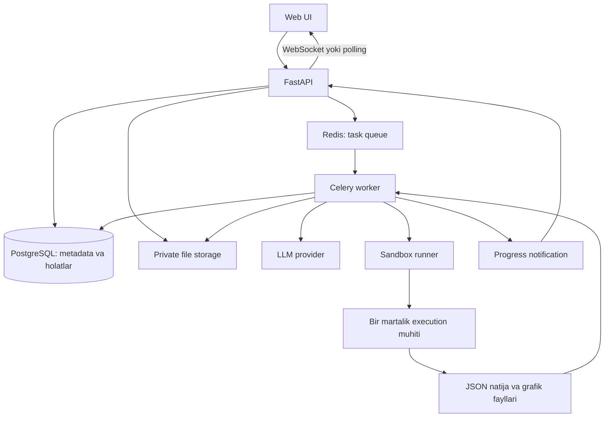

# Autonomous Data Analyst Agent — loyiha tahlili

> Bu hujjat dastlabki arxitektura rejasidir. Keyin yaratilgan v0.4 kodining amaldagi imkoniyatlari va ishga tushirish yo‘riqnomasi [README.md](../README.md)da. Quyidagi “hozirgi holat” tahlil yozilgan paytga tegishli.

## 1. Hozirgi holat

2026-09-26 kuni tekshirilgan ishchi papkada yagona loyiha hujjati — `readme_project.md`. Backend, frontend, konfiguratsiya, dependency ro‘yxati va testlar hali mavjud emas. Shuning uchun bu hujjat mavjud kod auditi emas, README asosida taklif etilgan arxitektura va amalga oshirish rejasidir.

README belgilagan asosiy talablar:

- Foydalanuvchi CSV yoki Excel fayl yuklaydi.
- Oddiy tilda savol beradi.
- Agent fayl tuzilishini o‘rganib, Pandas/Python kodi yozadi.
- Kod ajratilgan muhitda bajariladi.
- Natija matn va grafik orqali qaytariladi.
- Kod xatosi bo‘lsa, agent uni o‘qib, cheklangan qayta urinish orqali tuzatadi.
- FastAPI va WebSocket orqali jarayon holati ko‘rsatiladi.

README’dagi LangChain va CrewAI misol tariqasida keltirilgan; ulardan foydalanish majburiy talab emas. Qolgan texnologiyalar va quyidagi limitlar — boshlang‘ich takliflar.

## 2. Mahsulotning asosiy qiymati

Maqsad — Python bilmaydigan foydalanuvchiga o‘z jadvali bo‘yicha tekshiriladigan javob olish imkonini berish. Oddiy chatbotdan farqi: javob real hisoblash natijasiga, dataset versiyasiga va saqlangan kodga bog‘lanadi.

Masalan, savdo jadvalida `order_date`, `customer_id`, `amount` ustunlari bo‘lsa, “Qaysi oyda tushum eng yuqori?” savoliga tizim oylik yig‘indilarni hisoblaydi, jadval va grafik yaratadi, eng yuqori oyni aytadi. Sana yoki summa ustuni tushunarsiz bo‘lsa, foydalanuvchidan aniqlik kiritishni so‘raydi.

“Eng ko‘p tushum bo‘lgan oy” va “keyingi oy prognozi” ikki xil vazifa: birinchisi mavjud ma’lumotning agregatsiyasi, ikkinchisi alohida tekshiruv va model baholashni talab qiladi.

## 3. Tavsiya etilgan texnologiyalar

| Qism | Tanlov | Sabab va chegara |
| --- | --- | --- |
| API | FastAPI + Pydantic | Upload, REST, WebSocket va kiruvchi/chiquvchi ma’lumot shartnomalari |
| Metadata | PostgreSQL + SQLAlchemy + Alembic | Dataset, suhbat, run, attempt va artifact yozuvlari; xom jadvallar DBga tiqilmaydi |
| Fon vazifalari | Celery + Redis | Uzoq davom etuvchi profiling va tahlil API jarayonidan alohida bajariladi |
| Tahlil | Pandas + NumPy | Jadvalni o‘qish, tozalash va hisoblash |
| Excel | openpyxl | MVPda `.xlsx`; eski `.xls` va makrosli fayllar keyin ham alohida qaror talab qiladi |
| Grafik | Matplotlib + Seaborn | Dastlab PNG; interaktiv grafikni keyingi bosqichga qoldirish |
| LLM | Provayder adapteri | Model va provayderni biznes logikasini qayta yozmasdan almashtirish |
| Agent | Aniq holatlarga ega oddiy boshqaruv moduli | Plan → generate → execute → validate → explain; multi-agent hozir kerak emas |
| Bajarish muhiti | Alohida sandbox runner | Bir martalik muhit, cheklangan resurs va o‘chirilgan tarmoq |
| Fayllar | Lokal private storage, keyin S3-compatible | Fayllar va grafiklar metadata bazasidan alohida saqlanadi |
| UI | React + TypeScript + Vite | Upload, preview, chat, progress va natija paneli uchun yetarli |
| Lokal ishga tushirish | Docker Compose | API, worker, DB va Redisni bir xil konfiguratsiyada ishga tushirish |

Bu hajmda FastAPI va Django’ni birga ishlatish shart emas. Django admin yoki murakkab boshqaruv paneli asosiy talabga aylansa, tanlovni qayta ko‘rish mumkin. Dastlab FastAPI yetarli.

Og‘ir hisoblashni alohida workerga chiqarish FastAPI rasmiy hujjatidagi tavsiyaga mos: [Background Tasks](https://fastapi.tiangolo.com/tutorial/background-tasks/). Excel formatlari va o‘qish parametrlarida Pandas’ning [read_excel](https://pandas.pydata.org/docs/reference/api/pandas.read_excel.html) hujjati asos bo‘ladi. Jadvaldagi qolgan tanlovlar ushbu loyiha uchun arxitektura taklifidir.

## 4. Ishlash oqimi va chegaralar



1. API upload hajmi va formatini tekshiradi, faylga ichki ID beradi va private storagega yozadi.
2. Profiling vazifasi ham resurslari cheklangan parser muhitida ishlaydi. Excel sheetlari, ustunlar, turlar va missing qiymatlar aniqlanadi.
3. Foydalanuvchi dataset previewini ko‘radi, zarur bo‘lsa sheet va parsing parametrlarini tanlaydi.
4. Savol uchun `AnalysisRun` yaratiladi. API `202 Accepted` va `run_id` qaytaradi.
5. Worker faqat shu datasetga tegishli suhbat, schema va ruxsat etilgan qisqa profilni agentga beradi.
6. Agent maqsad, ustunlar, filtrlar va kutilgan natija turini rejalashtiradi. Noaniqlik bo‘lsa `needs_input` holatiga o‘tadi.
7. Yaratilgan kod dastlabki tekshiruvdan o‘tadi, so‘ng sandboxda bajariladi. Matn yoki AST tekshiruvi xavfsizlik chegarasi hisoblanmaydi.
8. Sandboxdan qaytgan JSON, jadval va grafiklar shartnoma bo‘yicha tekshiriladi.
9. Tuzatilishi mumkin bo‘lgan kod xatosida qisqartirilgan, maxfiy ma’lumotdan tozalangan xato agentga qaytariladi. Har urinish toza muhitda boshlanadi.
10. Yakuniy javob haqiqiy hisoblash natijalariga bog‘lanadi. Kod, parametrlar va dataset versiyasi keyin tekshirish uchun saqlanadi.

API fayllarni qabul qiladi va huquqlarni tekshiradi. Worker agent jarayonini boshqaradi. Runner faqat cheklangan bajarishni ta’minlaydi. LLM Pythonni o‘z jarayonida bajarmaydi va storage yoki DB kalitlarini olmaydi.

## 5. Taklif etilgan papka tuzilmasi

Quyidagi daraxt reja hisoblanadi; ushbu tahlil paytida faqat `docs/` hujjatlari yaratildi.

```text
autonomous-data-analyst/
├── readme_project.md             # Dastlabki g‘oya
├── README.md                     # O‘rnatish va ishga tushirish
├── .env.example                  # Qiymatsiz konfiguratsiya namunasi
├── .gitignore
├── compose.yaml
├── docs/
│   ├── PROJECT_ANALYSIS.md       # Arxitektura va qarorlar
│   └── TECHNICAL_SPEC.md         # Talablar va qabul mezonlari
├── backend/
│   ├── pyproject.toml
│   ├── Dockerfile
│   ├── alembic.ini
│   ├── migrations/
│   ├── app/
│   │   ├── main.py               # FastAPI yig‘ilishi va lifecycle
│   │   ├── api/
│   │   │   ├── dependencies.py   # DB session va foydalanuvchi konteksti
│   │   │   └── v1/
│   │   │       ├── datasets.py
│   │   │       ├── conversations.py
│   │   │       ├── runs.py
│   │   │       ├── artifacts.py
│   │   │       └── events.py
│   │   ├── core/                # Config, logging, auth, limitlar
│   │   ├── db/                  # ORM modellar va session
│   │   ├── schemas/             # API, plan va execution shartnomalari
│   │   ├── services/            # Dataset, conversation va run qoidalari
│   │   ├── agent/
│   │   │   ├── orchestrator.py  # Holatlar va retry chegaralari
│   │   │   ├── planner.py
│   │   │   ├── codegen.py
│   │   │   ├── validator.py
│   │   │   ├── reporter.py
│   │   │   └── prompts/
│   │   ├── analysis/            # Profiling va tekshirilgan statistik funksiyalar
│   │   ├── integrations/
│   │   │   ├── llm/             # Provayder adapteri
│   │   │   ├── storage.py
│   │   │   └── sandbox.py       # Runner klienti; Pythonni bu yerda bajarmaydi
│   │   └── workers/             # Celery app, profiling va analysis tasklari
│   └── tests/
│       ├── unit/
│       ├── integration/
│       └── fixtures/            # Sintetik CSV/XLSX va kutilgan natijalar
├── sandbox/
│   ├── runner/                  # Task ishga tushirish, limit, cleanup
│   ├── image/
│   │   ├── Dockerfile           # Oldindan o‘rnatilgan tahlil paketlari
│   │   └── entrypoint.py        # Input/output protokoli
│   └── tests/                   # Izolyatsiya va resurs limitlari tekshiruvi
├── frontend/
│   ├── package.json
│   └── src/
│       ├── api/
│       ├── components/
│       ├── features/
│       │   ├── upload/
│       │   ├── dataset-preview/
│       │   ├── chat/
│       │   └── analysis-results/
│       └── pages/
└── scripts/                     # Lokal setup va demo ma’lumot yaratish
```

API routerlari ichida Pandas tahlili yoki agent sikli yozilmaydi. Agent ichida HTTP va ORM detallarini tarqatmaslik kerak. Alohida `repositories/` kabi qo‘shimcha qatlamlar faqat amaliy ehtiyoj paydo bo‘lganda qo‘shiladi.

## 6. Muhim xavflar va yechimlar

| Xavf | Loyiha uchun yechim |
| --- | --- |
| Agent kodi hostga zarar yetkazishi | Alohida runner, tarmoqsiz bajarish, secretsiz muhit, faqat task fayllari, resurs limitlari |
| Fayl ichida prompt injection | Ustun nomi va katak matnlari ishonchsiz ma’lumot; tool huquqlarini server belgilaydi |
| Xatosiz, lekin noto‘g‘ri hisoblash | Reference datasetlar, plan va natija validatsiyasi, amallar va taxminlarni ko‘rsatish |
| Cheksiz tuzatish yoki katta LLM xarajati | Attempt, vaqt, token va parallel run limitlari |
| Katta yoki zararli Excel | Parser izolyatsiyasi, kengaytirilgan hajm va sheet limitlari, timeout |
| Worker qayta ishga tushishi | Persisted status, idempotent task, lease/heartbeat va eskirgan runlarni tiklash |
| WebSocket uzilishi | DBdagi event ketma-ketligi va REST polling orqali tiklanish |
| Boshqa foydalanuvchi fayliga kirish | Har bir obyekt uchun ownership tekshiruvi; tasodifiy IDning o‘zi yetarli emas |
| Ma’lumot yetarli bo‘lmagan prognoz | Forecastni MVPdan ajratish; vaqt bo‘yicha backtest va baseline bilan baholash |

Oddiy Docker konteynerini to‘liq xavfsiz sandbox deb qabul qilmaslik kerak. Docker’ning [security](https://docs.docker.com/engine/security/), [seccomp](https://docs.docker.com/engine/security/seccomp/) va [rootless](https://docs.docker.com/engine/security/rootless/) imkoniyatlari himoya qatlamlaridir. Bizning taklif: lokal, nazoratli demo uchun shu qatlamlarni tekshirish; ommaviy ko‘p foydalanuvchili ishga tushirishdan oldin alohida host va kuchliroq izolyatsiya variantini baholash.

## 7. Amalga oshirish tartibi

1. **Asos:** backend skeleton, konfiguratsiya, migration, private storage, lokal identifikatsiya chegarasi.
2. **Upload va profiling:** CSV/XLSX validatsiyasi, sheet tanlash, preview va schema. Bu bosqich LLMsiz tekshiriladi.
3. **Sandbox:** oldindan yozilgan xavfsiz tahlilni bajarish, timeout va izolyatsiya sinovlari. Agentni ulashdan oldin bu ishlashi kerak.
4. **Agent:** strukturali plan, kod yaratish, validatsiya, cheklangan self-correction, natijaga tayangan izoh.
5. **Fon ishlari va UI:** queue, persisted events, WebSocket, chat va natija paneli; vertikal demo oqimi.
6. **Mustahkamlash:** ownership, restart/cancel holatlari, cleanup, reference datasetlar va xarajat kuzatuvi.
7. **Keyingi versiya:** statistik prognoz, ko‘p faylli join, eksport va interaktiv grafiklar.

Birinchi demo mezoni: sintetik savdo CSV yuklanadi → “oylik tushumni hisobla” savoli beriladi → haqiqiy hisoblangan jadval, grafik va izoh qaytadi → bitta tuzatiladigan xatoda agent chegaralangan qayta urinish qiladi.

## 8. Hali kelishilmagan qarorlar

LLM provayderi/modeli, budjet, hosting, autentifikatsiya provayderi, ma’lumotni saqlash muddati va real dataset hajmi README’da ko‘rsatilmagan. Lokal prototip uchun quyidagi texnik topshiriqdagi vaqtinchalik defaultlar bilan boshlash mumkin. Real mijoz ma’lumotini tashqi LLMga yuborish siyosati va ommaviy deployment izolyatsiyasi esa tegishli bosqichdan oldin aniq belgilanadi.
